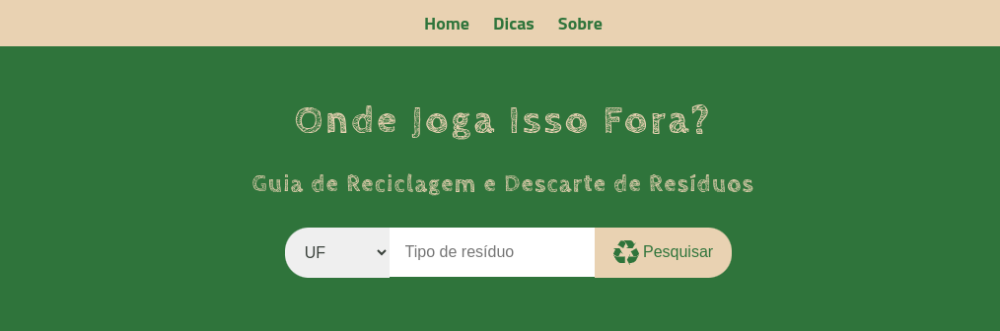
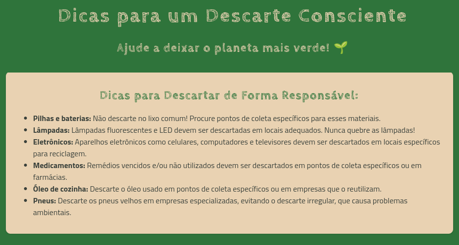

## ♻️ "Onde Joga Isso Fora?" - O seu guia do descarte consciente! ♻️ 

**Olá, exploradores da vida sustentável!** 👋 

Se você já se fez alguma dessas perguntas: 

* *"Eu jogo essa lâmpada velha no lixo comum mesmo?"* 💡
* *"Será que esse óleo de fritura vai entupir meu esgoto?"* 🪣
* *"Tem algum lugar pra eu empilhar essa pilha de pilhas?"* 🔋🔋🔋

**Bem... você chegou ao lugar certo!** 📌🗺️

## 📋 Sobre  

**"Onde Joga Isso Fora?"** é a aplicação que vai reciclar a ideia de como você deve lidar com seus resíduos. 🗑️  Imagine um lugar onde encontrar um ponto de coleta para qualquer tipo de material é tão fácil quanto pedir um delivery! 🍕

A missão do projeto é tornar o descarte responsável simples e acessível para todos! 👨‍👩‍👧‍👦 Cada um de nós pode fazer a diferença no cuidado com o meio ambiente e construir um futuro mais sustentável. 🌱

<h2>⚙️ Funcionamento</h2>

### 🛠️ Como funciona? 

1. **Pesquisa simples:** Digite o tipo de resíduo que você quer descartar (pilhas, remédios, plástico, etc.) e pronto! ✨ O app mostra os locais de coleta mais próximos de você, com informações detalhadas como endereço e horários. 📫🕙
2. **Mágica acontece:** A aplicação vasculha todos os dados dos pontos de descarte e te mostra os resultados que combinam com a sua busca. 📃
3. **Clique e descubra:** Cada resultado te leva para um link com mais informações sobre o ponto de coleta de resíduos. 🔗

### ➕ E mais!

* **Dicas e truques:**  Aprenda dicas de como preparar os itens para descarte e também para reduzir o desperdício e reutilizar materiais, tornando sua vida mais sustentável e menos "lixosa". ♻️🌲 

## ❓ Por que usar o "Onde Joga Isso Fora?" 

* **🚫 Diga adeus à confusão:** Jogue fora o que precisa, sem ter que perder tempo pesquisando a fio na internet.
* **🦸 Seja um agente da reciclagem:** Faça a diferença no meio ambiente, cuidando do planeta e descartando tudo no lugar certo. 
* **😌 Viva mais tranquilo:** Descarte os resíduos com segurança e evite problemas com o descarte inadequado.

**Vamos juntos nesta jornada rumo a um futuro mais sustentável!** 💚

---

## 🌐 Como usar: 

**🔗 Acesse o link:** [Clique aqui](https://onde-joga-isso-fora.vercel.app/) para abrir a aplicação web e testar a busca na base de dados. 

---

<h2>🏗️ Estrutura</h2>

## 🛠 Tecnologias usadas: 

* **HTML:** A estrutura básica da página, como se fosse a ossatura de um site. 🦴
* **CSS:** O estilo da página, deixando tudo bonito e organizado. 💄
* **JavaScript:** A parte mais inteligente, que faz a busca e mostra os resultados na tela. 🧠
* **Google Gemini:** A ferramenta de IA do google que é capaz de fazer coisas inacreditáveis 🪄 (inclusive ajudar muito um desenvolvedor de software 😅).

 

 
 
 
   

## 📂 Estrutura do Projeto

## 🚀 Futuras Melhorias

- [ ] **Compartilhamento**: Facilitar o compartilhamento em redes sociais.
- [ ] **Filtros Personalizados**: Adicionar filtros por resíduos ou região.
- [ ] **Geolocalização**: Implementar API do Google Maps para geolizalização dos ecopontos.
- [ ] **Barra de Navegação**: Adicionar mais itens como 'Resíduos' e 'Tratamento'.

 

---

<h2>🔨 Contribuição</h2>

## 💪 Quer contribuir? 

**🧭 Para melhorar o "Onde Joga Isso Fora?", siga estas etapas:**

1. **🔀 Clone o repositório:** Use o Git para baixar o código para o seu computador. 
2. **🔍 Explore o código:** Navegue pelo código desenvolvido para entender seu funcionamento. 
3. **🪛 Faça melhorias:** A aplicação web é de código aberto e usa a MIT License. Fique à vontade para implementar melhorias e contribuir com o projeto! 

## 🔬 Observações: 

* **🎲 Dados:** Os dados dos pontos de coleta estão armazenados no arquivo `dados.js`. Você pode adicionar ou modificar esses dados para personalizar a aplicação.
* **📑 Melhorias:** Essa é apenas uma versão inicial da aplicação. Existem muitas possibilidades de melhorias, como:
    * **Base de Dados:** Adicionar pontos de coleta por estados que a aplicação ainda não contempla.
    * **Filtros:** Adicionar filtros para buscar por resíduo ou outras características.
    * **Detalhes:** Mostrar mais detalhes sobre cada resíduo, como tempo de vida, contaminação, periculosidade.
    * **Design:** Melhorar a aparência da página para torná-la mais atraente.

**Sinta-se livre para contribuir para este projeto!** 🙌 Se você tiver alguma dúvida ou quiser colaborar, abra uma issue ou pull request. 😉

 

---

<h2>💻 Desenvolvimento</h2>

## 🧑‍💻 Desenvolvido por: 

**Wellington Morais | [Perfil no GitHub](https://github.com/wellingtonmnf)**

* **Deploy: 06/09/2024**
* **Última atualização: 12/09/2024**

## 📜 Licença 

 Este projeto está licenciado sob a licença MIT. Este projeto foi desenvolvido apenas para fins educacionais e não possui fins comerciais.

## 📝 Notas 

Este projeto foi criado durante a Imersão Dev_ com Gemini realizada pela Alura, entre os dias 02 e 06 setembro de 2024

Por conta de seu propósito educacional, o código JavaScript foi implementado e totalmente comentado para um melhor entendimento daqueles que tiverem dúvidas. 

Quaisquer dúvidas ou esclarecimentos, por favor entrem em contato pelo perfil do GitHub ou quaisquer meios expostos neste.

 

---

## 1, 2, 3... YES!

## ♻️ Venha reciclar a sua relação com o lixo! ♻️ 

**#reciclagem #descarteconsciente #meioambiente #sustentabilidade #ondejoga #app #aplicacao #github #open-source**