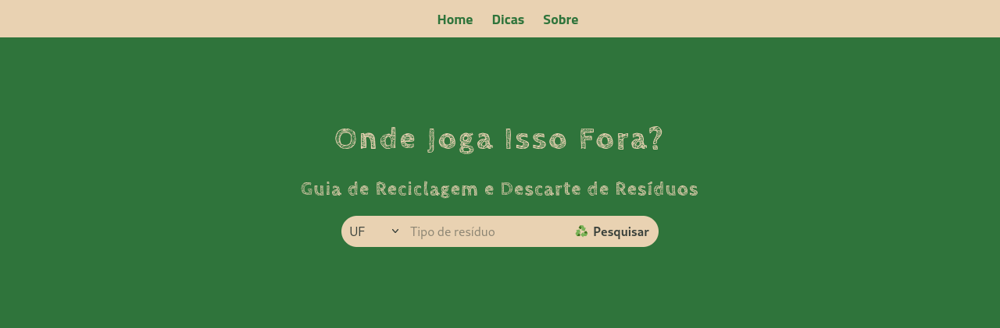

##  ♻️  "Onde Joga Isso Fora?" - O Guia Definitivo para Descartar Tudo com Estilo! ♻️ 

**Olá, aventureiros do descarte consciente!** 👋 

Se você já se fez alguma dessas perguntas: 

* "Eu jogo essa lâmpada velha no lixo comum mesmo?" 
* "Será que esse óleo de fritura vai entupir meu esgoto?"
* "Tem algum lugar pra eu empilhar essa pilha de pilhas?"

**Bem... você chegou ao lugar certo! 🎉**

## O que faz essa aplicação? ##

**"Onde Joga Isso Fora?"** é a aplicação que vai reciclar a ideia de como você deve lidar com seus resíduos. 🌎  Imagine um mundo onde encontrar um ponto de coleta para qualquer tipo de material é tão fácil quanto pedir um delivery! 🍕

**Como funciona?**

1. **Busca mágica:** Digite o tipo de resíduo que você quer descartar (pilhas, remédios, plástico, etc.) e pronto! ✨ O app mostra os locais de coleta mais próximos de você, com informações detalhadas como horários, tipos de materiais aceitos e dicas de como preparar os itens para descarte. 
2. **Mágica acontece:** A aplicação vasculha todos os dados dos pontos de descarte e te mostra os resultados que combinam com a sua busca.
3. **Clique e descubra:** Cada resultado te leva para um link com mais informações sobre o ponto de coleta de resíduos.

**E mais!**

* **Mapa da sustentabilidade:** Visualize os pontos de coleta no mapa e encontre o que está mais próximo da sua localização. 🗺️
* **Dicas e truques:**  Aprenda dicas para reduzir o desperdício e reutilizar materiais, tornando sua vida mais sustentável e menos "lixosa". 🌱

**Por que "Onde Joga Isso Fora?" é o app que você precisa?**

* **Diga adeus à confusão:** Jogue fora o que precisa, sem ter que pesquisar horas a fio na internet. 🚫
* **Seja um herói da reciclagem:** Faça a diferença no meio ambiente, cuidando do planeta e descartando tudo no lugar certo.  🦸
* **Viva mais tranquilo:** Descarte os resíduos com segurança e evite problemas com o descarte inadequado. 😌

**Junte-se a nós nesta jornada rumo a um futuro mais verde!** 💚

## Como usar: ##

1. **Acesse o link:** [Clique aqui](https://imersao-dev-gemini-alura.vercel.app/) para abrir a aplicação web e testar a busca na base de dados.

**Quer contribuir?**

**Para melhorar o "Onde Joga Isso Fora?", siga estas etapas:**

1. **Clone o repositório:** Use o Git para baixar o código para o seu computador.
2. **Abra o index.html:** Use um navegador (como Chrome, Firefox ou Edge) para abrir o arquivo index.html.
3. **Comece a pesquisar:** Divirta-se explorando o mundo da reciclagem!

**Tecnologias usadas:**

* **HTML:** A estrutura básica da página, como se fosse a ossatura de um site.
* **CSS:** O estilo da página, deixando tudo bonitinho e organizado.
* **JavaScript:** A parte mais inteligente, que faz a busca e mostra os resultados na tela.

**Observações:**

* **Dados:** Os dados dos pontos de coleta estão armazenados no arquivo `dados.js`. Você pode adicionar ou modificar esses dados para personalizar a aplicação.
* **Melhorias:** Essa é apenas uma versão inicial da aplicação. Existem muitas possibilidades de melhorias, como:
    * **Base de Dados:** Adicionar pontos de coleta por cidades que a aplicação ainda não contempla.
    * **Filtros:** Adicionar filtros para buscar por resíduo ou outras características.
    * **Detalhes:** Mostrar mais detalhes sobre cada resíduo, como tempo de vida, contaminação, periculosidade.
    * **Design:** Melhorar a aparência da página para torná-la mais atraente.

**Estou ansioso para receber sua contribuição para este projeto!** 🙌 Se você tiver alguma dúvida ou quiser colaborar, abra uma issue ou pull request. 😉

## "Onde Joga Isso Fora?", o app que vai mudar a sua relação com o lixo! ## 🚀

**1, 2, 3... YES!**

**#reciclagem #descarteconsciente #meioambiente #sustentabilidade #ondejoga #app #aplicacao #github #open-source**

**Wellington Morais | [Perfil no GitHub](https://github.com/wellingtonmnf)**

* **Deploy: 06/09/2024**
* **Última atualização: 06/09/2024**

---

### Projeto base da Imersão Dev_ com Gemini da Alura

Este projeto foi criado durante a Imersão Dev_ com Gemini realizada pela Alura, entre os dias 02 e 06 setembro de 2024

  1. [x] Aula 01: Iniciando o Projeto com HTML e CSS
  2. [x] Aula 02: Estilizando o projeto com CSS
  3. [x] Aula 03: Criando a base de dados com JavaScript
  4. [x] Aula 04: Implementando a funcionalidade de busca
  5. [x] Aula 05:Finalizando o projeto com GitHub e Deploy